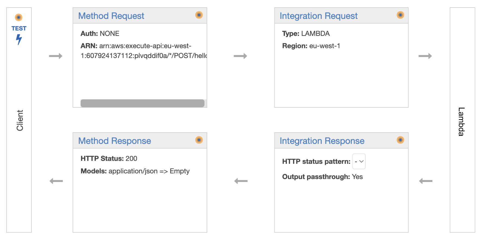
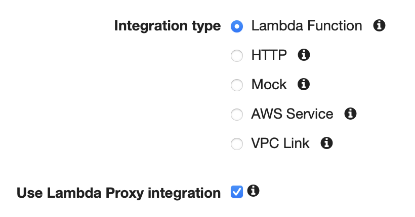
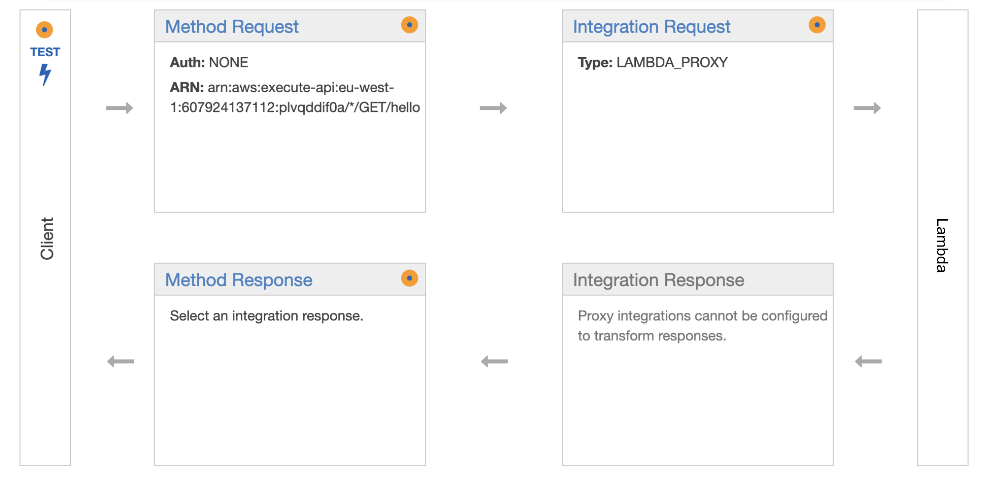
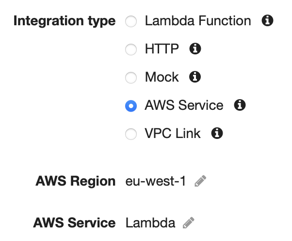
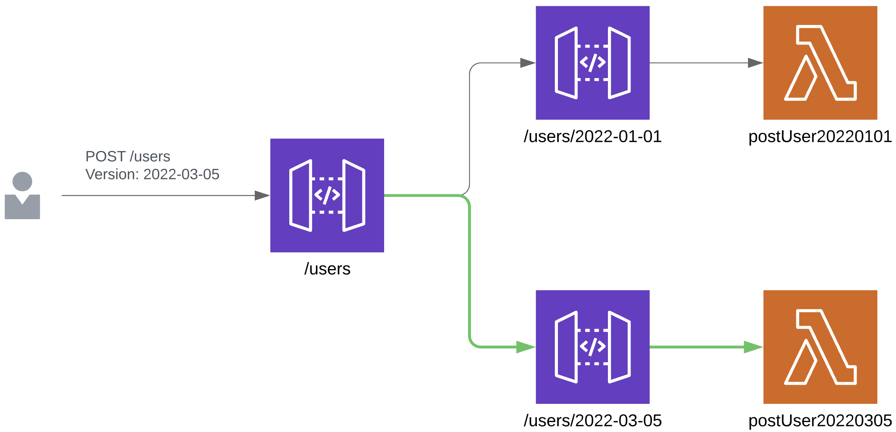
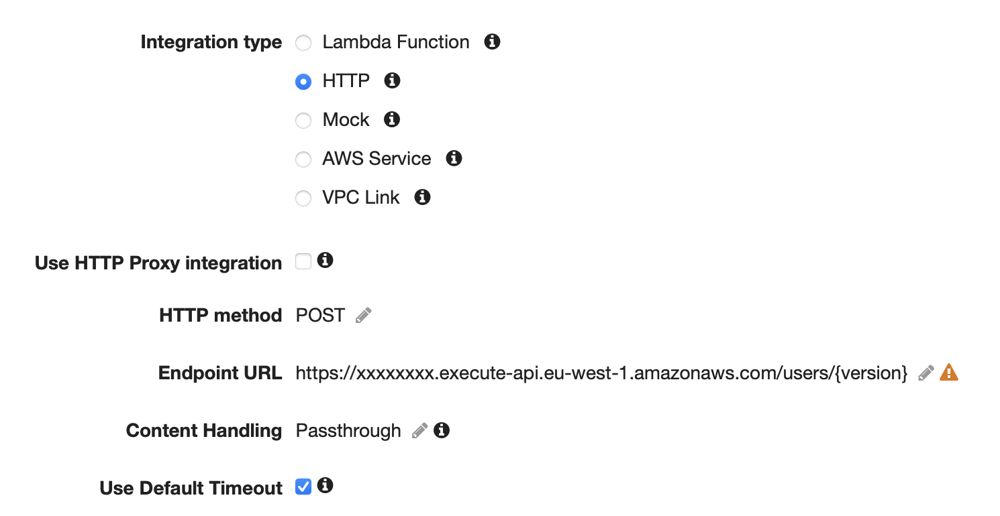
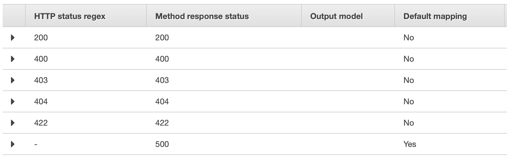
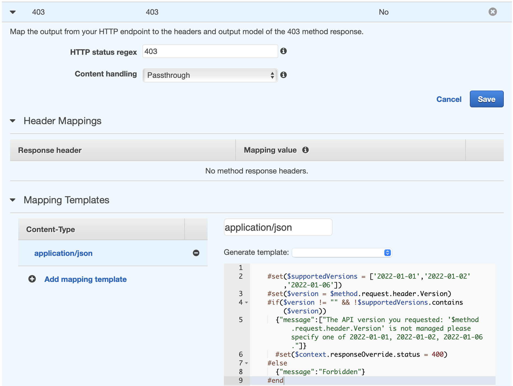
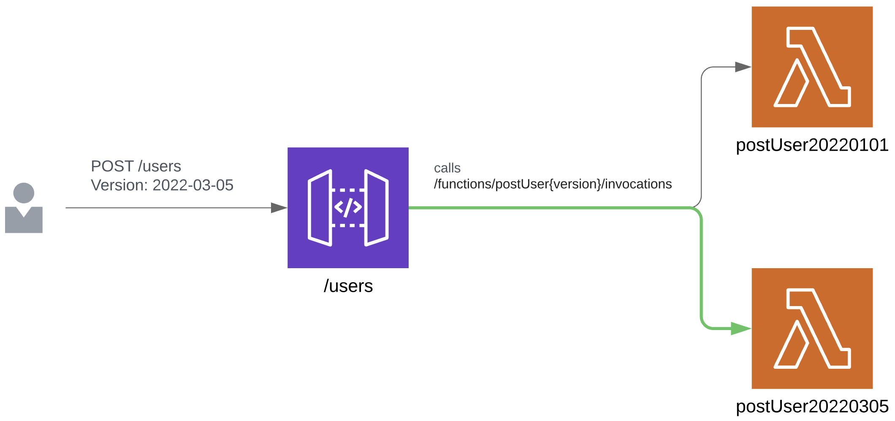
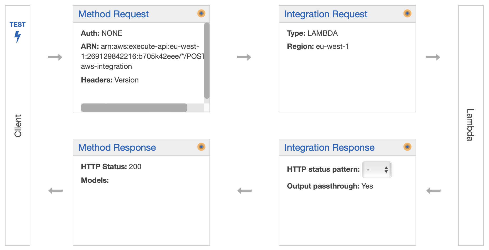

Read if: 
- You want to know how to version your AWS Serverless API the way pure players do 🔥
- You don’t like cold starts ❄️
- You enjoy eating lambdas for breakfast 🍳

# Introduction

## What is API Versioning and why should I care ?

Let’s say you are the owner of a very sophisticated API allowing your clients to post a username on your `/users` route and receive all the information you have about this username.

The request and could look like

```json
POST /users
body: {"username": "awesomeUser123", "age": 25, "job": "software engineer"}
```

and the response 

```json
{
	"statusCode": 200,
	"body": {"id": "000024671"}
}
```

You now need the user's company and refactored the input this way:
```json
{"age": 25, "job": { "title": "software engineer", "company": "Stroupe" }}
```

It would be a bad practice to update your code and publish it right away because this would immediately break all the services relying on your API. A better and nicer solution would be to upgrade your API and communicating about it the right way 📚.


>🦸 API Versioning allows you to make breaking changes and keep your clients happy.

## How do clients access versioned APIs ?

>💡 We will use date-based version names like “2022-01-01” (implementation date) instead of traditional v1, v2...
>It is easier to track, to use, and to document.

There are 2 main ways your API consumers can query a specific version of your API, either with a path parameter, by calling `POST /2022-01-01/users`, or by using a dedicated HTTP header.

State of the art players, like [Stripe](https://stripe.com/blog/api-versioning), chose to provide header based API versioning. Indeed, the paths of your API will be kept as simple as possible. It's sexier to call a `GET /users` than a `GET /users/2022-01-01` right?

We will detail two ways of implementing a header based API Versioning system using AWS API Gateway and Lambda.

# Solutions

TL;DR : here is a quick summary of the pros and cons of each solution. 
**Our team chose solution 1**

|  | Method 1: HTTP Proxy | Method 2: Custom Lambda Integration |
| --- | --- | --- |
| Cost | ❌ 1 request = 2 API Gateway calls | ✅ 1 request = 1 API Gateway call |
| Performance | ❌ Slight performance loss (~20ms) due to proxy. | ✅ No loss |
| Code Simplicity | ✅ Less CF Resources | ❌ can’t use Lambda Proxy Integration. Pain for Serverless Framework users. |
| VTL Usage | ✅ + (moderate usage) | ❌ +++ (intensive usage) |

---

> 🧠 Skip the next two parts if you’re already familiar with API Gateway REST API internals.

# API Gateway Request and Response flow in REST APIs

This is how API Gateway handles request to a REST API.

There are 6 steps.



1️⃣ API Gateway receives the request

2️⃣ It is passed to the Method Request, where we can perform input validation, headers validation, provide the route with authorizers..

3️⃣ Data is passed to Integration Request. We specify the hanler (a Lambda Function, another AWS Service, another HTTP endpoint …) and manipulate the body / headers that will be passed down using [VTL](https://velocity.apache.org/engine/2.0/vtl-reference.html).

4️⃣ The request is processed by the business logic handler 🧠.

5️⃣ In the Integration Response, we manipulate the handler output (status code, body) and override it with our own logic. For example, a 403 from DynamoDB Service could be changed to a 400 for the client with a custom error message.

6️⃣ Similarly to Method Request, we perform data output validation.

# API Gateway Integration types

In this part, we will focus on the Integration Request part (3️⃣ in previous paragraph).

API Gateway provides its users several integration types, with a lot of services. We will cover two of them.

## 1. Lambda Proxy

Because the API Gateway <> Lambda duo is so powerful, API Gateway provides us with a simple, powerful, and nimble mechanism to build an API with the setup of a single API method.

It is the simplest way to integrate lambdas with API Gateway and, for Serverless Framework users, it is what is being built under the hood when you choose to deploy a lambda triggered by a REST API HTTP event.



In your code, your Lambda only returns a status code and a body.

```tsx
export const greetUser = async ({ name }) => {
  if (typeof name !== "string") {
    return { statusCode: 400, body: "Your name must be a string" };
  }

  return { statusCode: 200, body: `Hello, ${name}!` };
```

This information is directly passed to the client, skipping Integration Response part.



## 2. Lambda Service Custom Integration

Directly integrates with other AWS Services APIs, including Lambda.



>💡 When integrating with Lambda Function (instead of the more general Lambda Service), you can return a custom status code based on a regex rule applied on the **error message of your lambda**. 
>When integrating with AWS Service Lambda, you can map the status code you **received from your call to the Lambda Service** to a custom status code of your choice.


Now let’s build a header-based versioning system !

# Method 1: HTTP Proxy Integration

We will use an intermediate proxy API route redirecting incoming requests to a layer of API routes. Routes in this layer are using Lambda proxy integration and have versions in their paths (e.g. `POST users/2022-01-01`). 

I will define the steps to configure the first API route.



## Integration Request



- Use HTTP Integration type.
- Optionally, use a mapping template to pass down the apiKey to the second API route and set a default version if no Version header is provided.

```tsx
#set($version = $method.request.header.Version)
#set($apiKey = $method.request.header.x-api-key)

#if(!$version ||$version == "")
  #set($version = "2022-01-01")
#end

#set($context.requestOverride.path.version = $version)
#set($context.requestOverride.header.x-api-key = $apiKey)

$input.json("$")
```

## Integration Response

The Integration Response input is the status code API Gateway received from its HTTP call to our sub API Gateway route (potentially a 403 if it was not found).

We will use mapping template to add logic (using VTL) to the response.
A very useful method you will need is `$context.responseOverride.status`

It allows you to override the final status code.

Now define each possible method response status (i.e. the status codes you want to expose to your client) and map them to the HTTP proxy call status code.

- By default, map the HTTP response to a 500. 
Use a mapping template to return a `{message: “Internal Server Error”}` object.
This way, any untackled behaviour ends up in a 500.
- Next, we will take care of the 403 special case. In the case where an unknown Version is passed by the client, the HTTP Proxy will try to invoke an undefined route, which will result in an API Gateway 403 response.
I chose to return a custom error message telling the client that the requested version was not found.

```java
#set($APIExposedVersions = ['20220101', '20220503'])

#set($version = $method.request.header.Version)

#if($version != "" and !$APIExposedVersions.contains($version))
  #set($context.responseOverride.status = 400)
  {message: "your custom version not found message"}
#else
  {message: "forbidden"}
#end
```

- Finally map all relevant status codes of your API to themselves. They will be passed as is.

It should look like that : 





 ---

**Summing it up !**

✅ Configuration remains quite simple <br>

✅ Your lambdas are still integrated with Lambda Proxy <br>

✅ Version can be accessed both with headers and with path <br>

❌ It implies additional costs: each call to the proxy route will generate a second call to versioned routes <br>

❌ Proxying takes around 20 to 40ms. <br>


# Method 2: Lambda Service Custom Integration

You have to lambdas, `postUser20220101` and `postUser20220305`. 

The goal is to have API Gateway directly call one lambda or the other based on the Version header.

It looks like this :





Let’s detail the Integration Request and Integration Response parts

## Integration Request

- Chose AWS Service > Lambda integration
- Use path override to tell API Gateway to invoke postUser{Version}
- Use URL Path parameters and define `version = method.request.header.Version`
It will allow API Gateway to invoke the right lambda based on the Version header

## Integration Response

The integration response input is the Lambda Service status code (which is different from the Lambda status itself, a lambda could be in error but the Lambda Service will return a 200 HTTP status code). The output is the Lambda Service response payload.

Now define each possible method response status and map them to the Lambda Service status code.

- First, define a mapping from Lambda Service 500 to a method response 500.
Indeed if Lambda Service returns a 500 we just want to pass it through.
- Then define a mapping from Lambda Service 404 to a 400.
Using a mapping template, check the payload you received from Lambda Service. If it mentions Lambda not found then override the response message with your custom Version not found message. To do that, just return in VTL an object with the information you want to provide your client with.
For example :
    
    ```tsx
    {"message": "The API version you requested: 
    '$method.request.header.Version' is not managed" }
    ```
    
    Else, use `$context.responseOverride.status` to override the status code to a 500
    
- Finally, define a default mapping to 200. You can easily access, using VTL, the payload of your lambda response. Make sure your lambda returns an object containing the expected `statusCode` (the same as you would do with Lambda Proxy). Parse the payload and override the statusCode, using `$context.responseOverride.status`, with your Lambda’s.

- That’s it, you kind of reimplemented the Lambda Proxy integration for the sake of versioning and client satisfaction 🎊.

We’re done, now fine-tune your VTL to make your version error message more explicit, by adding a list of supported versions for example !

---

**Summing it up !**

✅ Implies no additional cost <br>

❌ Requires lots of API Gateway twisting and you can’t use Lambda Proxy integration. <br>

❌ If you use the Serverless Framework, you will need to write a lot of cloudformation to deploy your versioned lambdas <br>

# Conclusion

We’ve learned two ways to define a header based API versioning system using AWS API Gateway and AWS Lambda. No unnecessary work is done by additional Lambdas, thus keeping cold starts as low as possible. All the work is done by blazing fast API Gateway internals 🔥.

---

I purposefully kept the implementation details light and simplified them the more that I could.
If you chose to implement one of these solutions but find it hard to do so, feel free ton contact me on [Twitter](https://twitter.com/valentinbeggi) or by leaving a comment below, I will be more than ✨API to help✨ !

---

If you achieved the same goal a different way, please tell me how in the comments 💪

Cheers ☀️